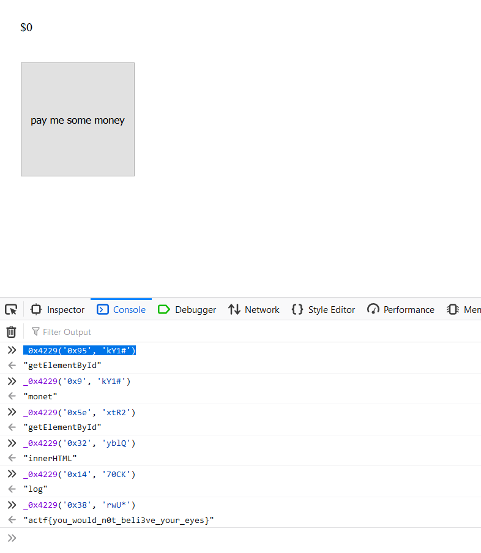

## Consolation 
  [Link](https://consolation.2020.chall.actf.co/)
  I've been feeling down lately... Cheer me up!

- Tới trang web thì thấy có một button, click vào thì tăng tiền. Xem source thì thấy có iftenmillionfireflies.js
  vào xem thấy code đã được obfuscator, deobfuscator thì được file iftenmillionfireflies.js trong git.
  tìm func nofret ta có được code. Thử console.log các dãy kiểu _0x4229('0x95', 'kY1#') này ra thử là gì
  và ta ra flag: actf{you_would_n0t_beli3ve_your_eyes}

  
  