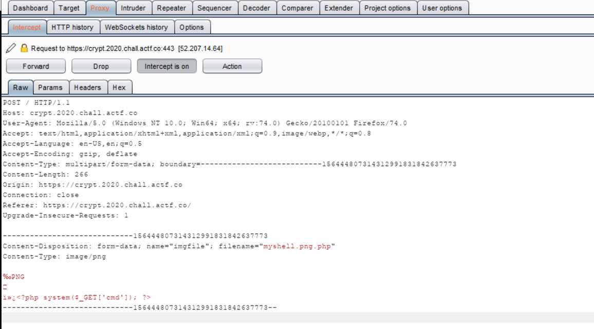
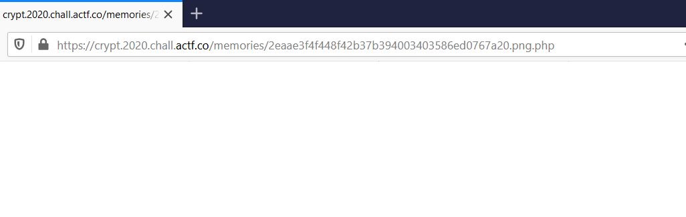
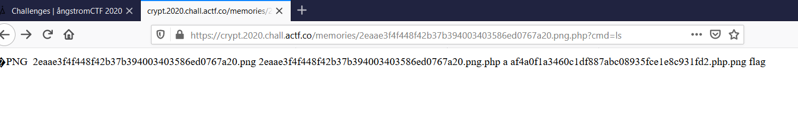

## Defund's Crypt

- Vào web xem thì thấy có 2 gợi ý /src.php và /flag.txt
  Đọc source thì thấy đây là trang upload file, chỉ nhận các file ảnh với đuôi jpg,png,bmp.

- Vậy việc ta cần làm là up file có định dạng mà server cho phép nhưng ta vẫn thực thi được con shell ta up lên. 
  Lỗi này là lỗi up load trong php.

- Trước tiên ta tạo một file có nội dung là , lệnh này quá quen thuộc phải không,
  ta lưu dưới tên myshell.png

- Ta add file signature của png vào file( search gg để tìm hiểu thêm, t dùng winhex để add) 

- Giờ thì upload file lên server, nhớ bật burpsuite để bắt traffic thay đổi request.

  

- Lúc này mình thêm đuôi .php vào và kết quả

  

- Lúc này test thử shell hoạt động không bằng cách ?cmd=ls , thì kết quả show ra

  

- Nhớ tới gợi ý lúc đầu /flag.txt nên dùng ngay lệnh ?cmd=cat /flag.txt, ra flag: actf{th3_ch4ll3ng3_h4s_f4ll3n_but_th3_crypt_rem4ins} 
  