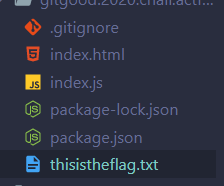
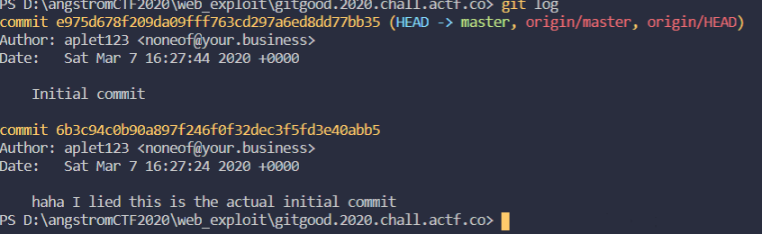
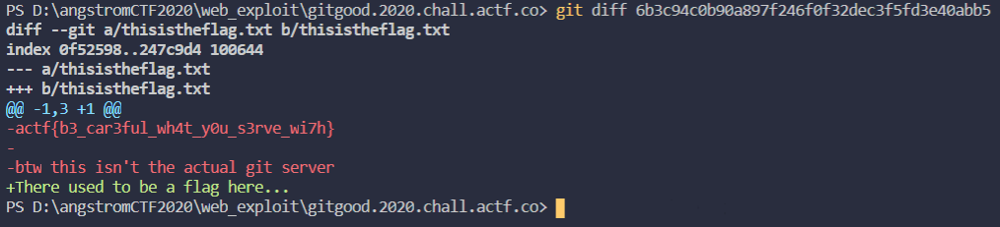

## Git Good

- Nghe tên thôi ta cũng thấy liên quan đến Git rồi. 
  ta dùng: git clone https://gitgood.2020.chall.actf.co/.git/
  để tải về source
  

  xem file thisistheflag.txt thì không thấy flag mà thấy "There used to be a flag here..."
  Vậy ta phải dùng git, xem những flag trước khi bị xóa hay thay đổi
  Ta dùng lệnh: git log 

  

  ta dùng lệnh: git diff 6b3c94c0b90a897f246f0f32dec3f5fd3e40abb5

  để xem sự thay đổi của file sẽ thấy flag: actf{b3_car3ful_wh4t_y0u_s3rve_wi7h}

  
