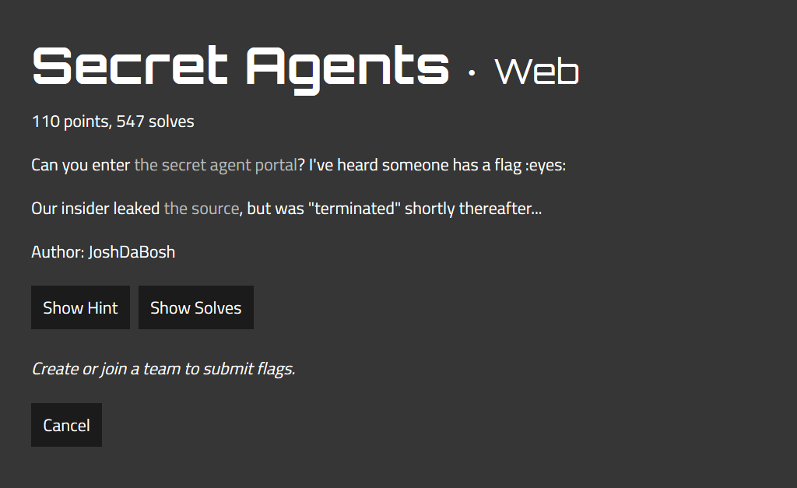
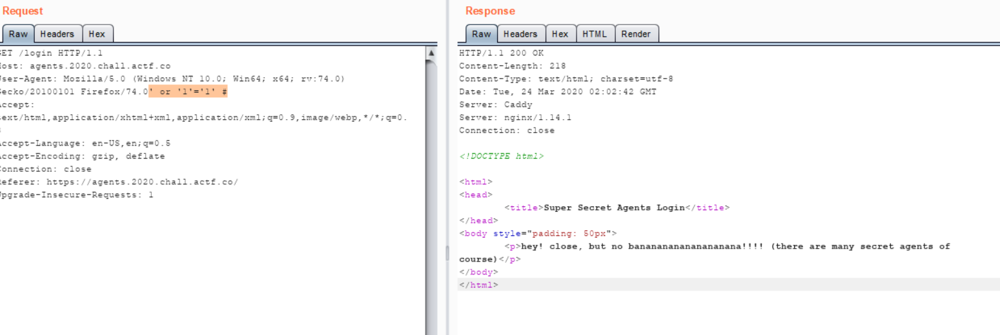
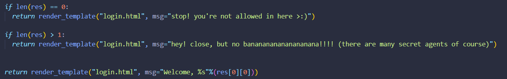
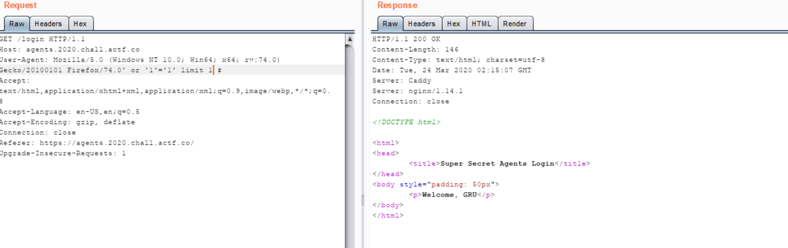
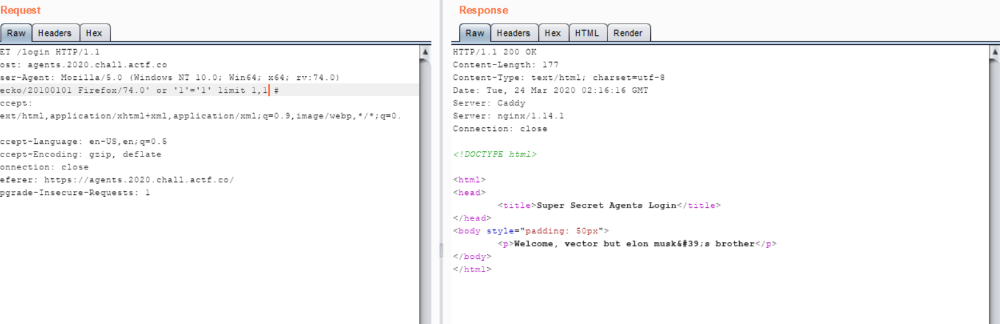
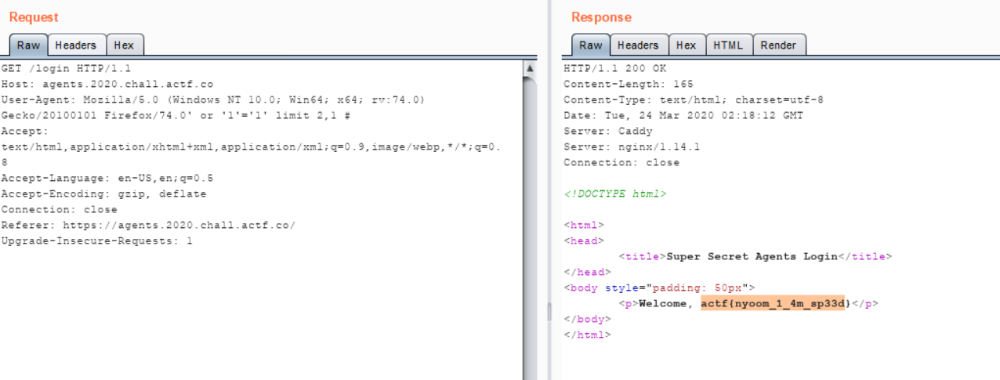

## Secret Agents - 100 points

  

- Bài này về SQL injection vector user-agents, mình thử dùng đoạn payload này ' or '1'='1' #
  thì res trả về 

  

- Đọc source ta thấy:

  

  ta đã rơi vào trường hợp len(res) > 1, vậy hàm fetchall() có tác dụng gì ?

- Hàm fetchall() lấy tất cả các hàng trong một tập kết quả. Nếu một số hàng đã sẵn sàng được trích từ tập kết quả đó, thì nó thu nhận các hàng còn lại từ tập kết quả.

- À vậy nên ta sẽ dùng thêm limit trong sql để giới hạn số dòng cần lấy,
  lần lượt thử cái query ' or '1'='1' limit 1 #

  

  ' or '1'='1' limit 1,1 #

  

  ' or '1'='1' limit 2 #
  ra tương tự như ban đầu ' or '1'='1' #

  ' or '1'='1' limit 2,1 # => ra flag : actf{nyoom_1_4m_sp33d}

  
