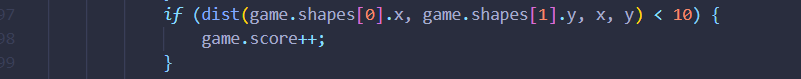
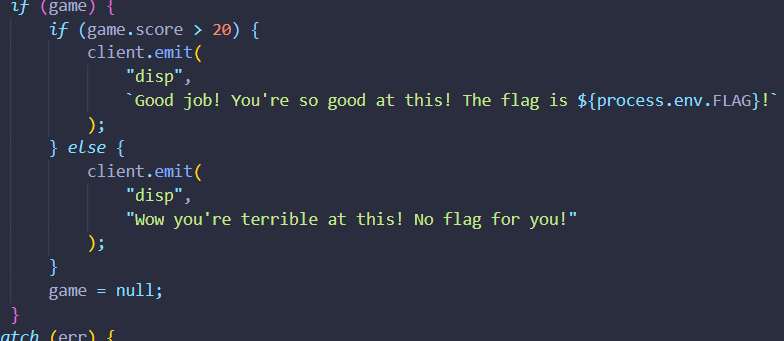
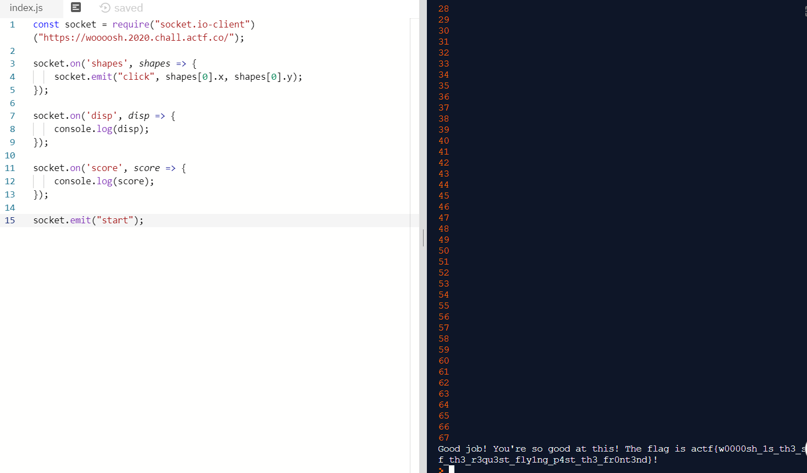

## Woooosh 

- Bài này liên quan đến socket.io trong nodejs. Đại loại trò này sẽ là random ra các ô hình vuông và trong đó là một cái là hình tròn 
  và nhiệm vụ của người chơi sẽ là click vào ô hình tròn đó, mỗi lần click cộng 1 điểm, được hơn 20 điểm ra flag. Và mỗi lượt click 
  có giới hạn thời gian, nếu trong click được trong thời gian nhất định sẽ thua.
  Và giờ nhiệm vụ của chúng ta là làm cách nào đó để việc click vào cái ô tròn đó và trong thời gian quy định đạt số điểm cần và ra flag.

- Sau khi đọc source và tìm hiểu về socket.io nodejs
  ta thấy có đoạn code này giúp tăng điểm:
  

  và đoạn này nếu muốn get flag
  

- t code ra đoạn code nằm trong file solve.js
  đầu tiên connect đến server,
  lắng nghe sự kiện shapes, có thì hành động click vào shapes[0].x, shapes[0].y vì dựa vào đoạn code nguồn đã đọc.
  socket.on('disp') là lắng nghe nếu có flag thì show ra.
  tương tự tiếp theo là show score
  cuối cùng socket.emit('start') tiếp tục vòng chơi tiếp.
  Liên tục như vậy đến khi hơn 20 điểm là ra flag

- Mình không biết tại sao được 68 điểm mới ra flag. Rõ ràng source chỉ ra nếu lớn hơn 20 là ra mà ta. Cơ mà thôi ra flag là được rồi.
  

  flag: actf{w0000sh_1s_th3_s0und_0f_th3_r3qu3st_fly1ng_p4st_th3_fr0nt3nd}
  