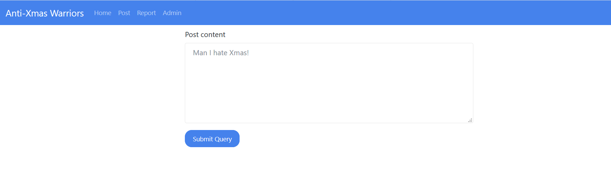
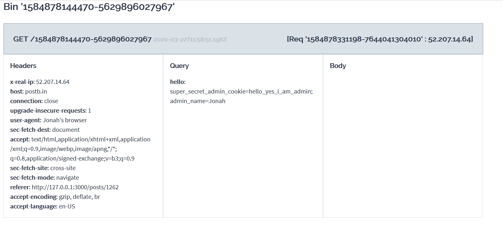

## Xmas Still Stands
  You remember when I said I dropped clam's tables? Well that was on Xmas day. And because I ruined his Xmas, he created the Anti Xmas Warriors to try to ruin everybody's Xmas. Despite his best efforts, Xmas Still Stands. But, he did manage to get a flag and put it on his site. Can you get it?

- Bài này khi nhìn vào ta thấy có trang admin, và có khung post content 
  
  thì ta nghĩ ngay đến việc đánh cắp cookie của admin để giả dạng admin ra flag. Ta nghĩ tới XSS, đoạn mã độc ta sẽ chèn vô
  
  https://postb.in/1584878144470-5629896027967?hello= cookie sẽ gửi đến địa chỉ này
  Sau đó chúng ta report post vừa nãy, vì chỉ có admin mới xóa được nó, nên khi xóa post này nó sẽ chạy mã độc chúng ta chèn vào và gửi cookie của nạn nhân (admin) đến địa chỉ ta chèn khi nãy

  

  Và ta biết được cookie của admin:
  super_secret_admin_cookie=hello_yes_i_am_admin; admin_name=Jonah

  

- Ok, vậy giờ giả danh admin thôi
  

- Flag: actf{s4n1tize_y0ur_html_4nd_y0ur_h4nds}
  
